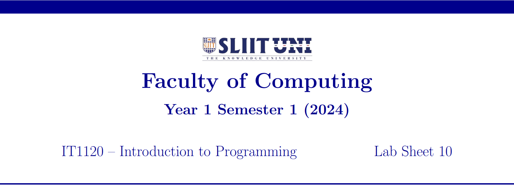
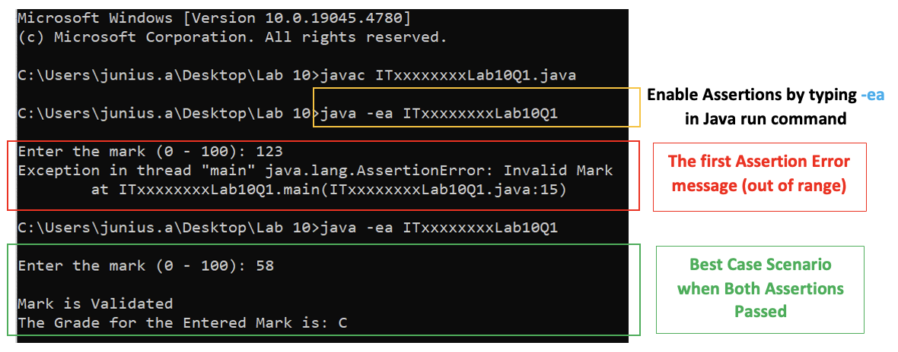

  

    
  

**Question 1**

> **a\)** Write a Java program that checks if a mark entered from the
> keyboard is within the valid range of 0 to 100 (inclusive).

> Use assertions to verify that the mark is within the specified range.
> If the mark is outside this range, the program should throw an
> **Assertion Error** with the message ***'Invalid Mark'***. If the mark
> is valid, display the message ***'Mark is Validated'***.

> **b\)** Modify the above program to determine the Grade.
> If the mark is valid, the program should then determine the
> corresponding letter grade: 'A' for marks 75 and above, 'B' for marks
> 60 to 74, 'C' for marks 50 to 59,'D' for marks 40 to 49, and 'F' for
> marks below 40.

> Use assertions to verify the grade assigned. If the grade assigned is
> incorrect, the program should throw an **Assertion Error** with the
> message ***'Incorrect Grade Assigned'***.

> Save the file inside **'Lab 10'** folder as:
> **ITxxxxxxxxLab10Q1.java**

> Replace 'ITxx xxx xxx' of the filename, with your own Student ID.

**Expected Output:**
  

    
  

  

    
  

